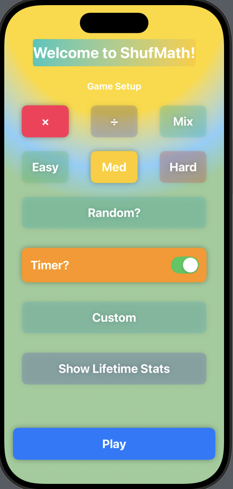
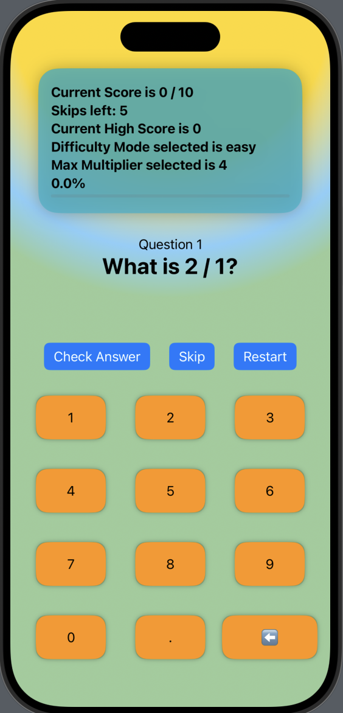

# ShufMath 🎓📱

**ShufMath** is a SwiftUI-based educational tool designed to make practicing multiplication and division fun and interactive. With customizable difficulty settings, a timer, and real-time score tracking, this app helps users improve their math skills in an engaging and competitive way.

## Features 🌟

### Gameplay Features:
- Randomly generated multiplication and division questions.
- User input validation with feedback (correct/incorrect answers).
- Real-time score tracking during gameplay.
- Timer to track performance within a set time limit.
- Supports decimal inputs for more advanced practice.

### Customization & Settings:
- Select number range and question quantity.
- Custom Difficulty with adjustable max multiplier/divider.
- High score tracking to motivate continuous improvement.

### Clean UI Design:
- Built using SwiftUI for a user-friendly and visually appealing interface.
- Responsive layout that adapts seamlessly to various iOS devices and screen sizes.

## App Icon 🎨
The app icon, **appIcon**, represents the app's dynamic and interactive nature. It features a **shuffle symbol**, which reflects the flexibility of choosing between multiplication, division, or a mix of both modes. The colorful design ties into the app's fun and engaging vibe, perfectly capturing the spirit of learning while offering customization options.


## How to Use 📝
1. Launch the app.
2. Select a difficulty (Easy, Medium, Hard) or choose Custom for personalized settings.
3. Start practicing multiplication or division by answering the questions presented.
4. Track your score, watch the timer, and aim to beat your high score!

## Future Enhancements 🚀
- Refactor the app to follow the MVVM architecture for better code organization and scalability.
- Add more challenging question types, including fractions or word problems.
- Implement a streaks feature to reward consecutive correct answers.
- Introduce power-ups to assist with difficult questions or increase points.

## Technologies Used 🔧
- Swift 5
- SwiftUI
- Xcode 14+

## Game Views
Here’s an example of the game setup and in-game view:

### Game Setup


### In-Game View


## Installation 🚀
1. Clone the repository:
   ```bash
   git clone https://github.com/your-username/shufmath.git
